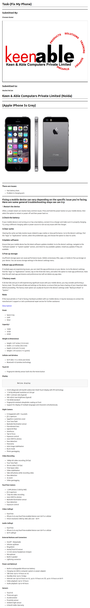

# ****Task-(Fix My Phone)****
___
## **Submitted By:**

#### ***Praveen Kumar***

## **Submitted to:**

#### ***Rashmi Ma'am***

# **Keen & Able Computers Private Limited (Noida)**

___
# ****(Apple iPhone 5s Grey)****

___

### ****There are issues:****
* Fast battery drain.
* Problem in charging port.

___  
## **Fixing a mobile device can vary depending on the specific issue you're facing. Here are some general troubleshooting steps we can try:** ##

### 1.****Restart the device:**** ### 
Often, a simple restart can resolve many common issues. Press and hold the power button on your mobile device, then select the option to restart or power off and then power back on.

### ****2.Check the battery:**** ###
 If your mobile device is not turning on or has a low battery, connect it to a charger and make sure it is properly charging. Try using a different charging cable or power source to rule out any issues with the charger.

### ****3.Clear cache:**** ###
Clearing the cache can help resolve issues related to app crashes or slow performance. Go to the device's settings, find the "Apps" or "Applications" section, select the problematic app, and choose the option to clear its cache.

### ****4.Update software:**** ###
Ensure that your mobile device has the latest software updates installed. Go to the device's settings, navigate to the "Software Update" or "System Update" section, and check for any available updates. Install any updates if they are available.

### ****5.Free up storage:**** ###
 Insufficient storage space can cause performance issues. Delete unnecessary files, apps, or media to free up storage on your device. You can access storage settings in the device's settings menu.

### ****6.Reset app preferences:**** ###
 If multiple apps are experiencing issues, you can reset the app preferences on your device. Go to the device's settings, find the "Apps" or "Applications" section, tap on the three-dot menu, and select the option to reset app preferences. Note that this will reset app permissions and preferences but will not delete any app data.

### ****7.Factory reset:**** ###
If all else fails and you're still experiencing significant issues with your mobile device, you may consider performing a factory reset. This will erase all data and settings on the device, so ensure that you have a backup of your important data before proceeding. The factory reset option can usually be found in the device's settings under "Backup & Reset" or "System."

### ****Note:**** ###
If the issue persists or if we're facing a hardware problem with our mobile device, it may be necessary to contact the manufacturer's support or visit a professional repair service for further assistance.

### [Description](https://filpz.com/products/apple-iphone-5s-16gb-space-gray?currency=INR&variant=32720559013970gclid=CjwKCAjwvJyjBhApEiwAWz2nLVf6F6E2zewT_kCnChY_6JxI5Z7LGE48DijYCTiWetTnZpWiYluwShoCGjEQAvD_BwE#)

#### ****Finish**** ####
- Space Gray
- Gold
- Silver

#### Capacity1 ####
- 16GB
- 32GB
- 64GB

#### Weight & Dimensions2 ####
- Height: 4.87 inches (123.8 mm)
- Width: 2.31 inches (58.6 mm)
- Depth: 0.30 inch (7.6 mm)
- Weight: 3.95 ounces (112 grams)

#### Cellular and Wireless ####
- Wi-Fi (802.11n 2.4GHz and 5GHz)
- Bluetooth 4.0 wireless technology

#### Touch ID
- Fingerprint identity sensor built into the Home button

#### Display
                 Retina display
- 4-inch (diagonal) LED-backlit widescreen Multi-Touch display with IPS technology
- 1136-by-640-pixel resolution at 326 ppi
- 800:1 contrast ratio (typical)
- 500 cd/m2 max brightness (typical)
- Full sRGB standard
- Fingerprint-resistant oleophobic coating on front
- Support for display of multiple languages and characters simultaneously

#### iSight Camera
- 8 megapixels with 1.5µ pixels
- ƒ/2.2 aperture
- Sapphire crystal lens cover
- True Tone flash
- Backside illumination sensor
- Five-element lens
- Hybrid IR filter
- Autofocus
- Tap to focus
- Exposure control
- Auto HDR for photos
- Face detection
- Panorama
- Auto image stabilisation
- Burst mode
- Photo geotagging

#### Video Recording
- 1080p HD video recording (30 fps)
- True Tone flash
- Slo-mo video (120 fps)
- Time-lapse video
- Video stabilisation
- Take still photos while recording video
- Face detection
- 3x zoom
- Video geotagging

#### FaceTime Camera
- 1.2MP photos (1280 by 960)
- ƒ/2.4 aperture
- 720p HD video recording
- Auto HDR for photos
- Backside illumination sensor
- Face detection
- Exposure control

#### Video Calling3
- FaceTime
- iPhone 5s to any FaceTime-enabled device over Wi-Fi or cellular
- HVGA-resolution (480 by 368) calls over - Wi-Fi

#### Audio Calling3
- FaceTime
- iPhone 5s to any FaceTime-enabled device over Wi‑Fi or cellular
- Wi-Fi calling4

#### External Buttons and Connectors
- On/off - Sleep/wake
- Volume up/down
- Ring/silent
- Home/Touch ID sensor
- 3.5-mm stereo headphone minijack
- Microphone
- Built-in speaker
- Lightning connector

#### Power and Battery5
- Built-in rechargeable lithium-ion battery
- Charging via USB to computer system or power adapter
- Talk time: Up to 10 hours on 3G
- Standby time: Up to 10 days
- Internet use: Up to 8 hours on 3G, up to 10 hours on LTE, up to 10 hours on Wi-Fi
- Video playback: Up to 10 hours
- Audio playback: Up to 40 hours

#### Sensors
- Touch ID
- Three-axis gyro
- Accelerometer
- Proximity sensor
- Ambient light sensor
- 6 Month Seller Warranty
